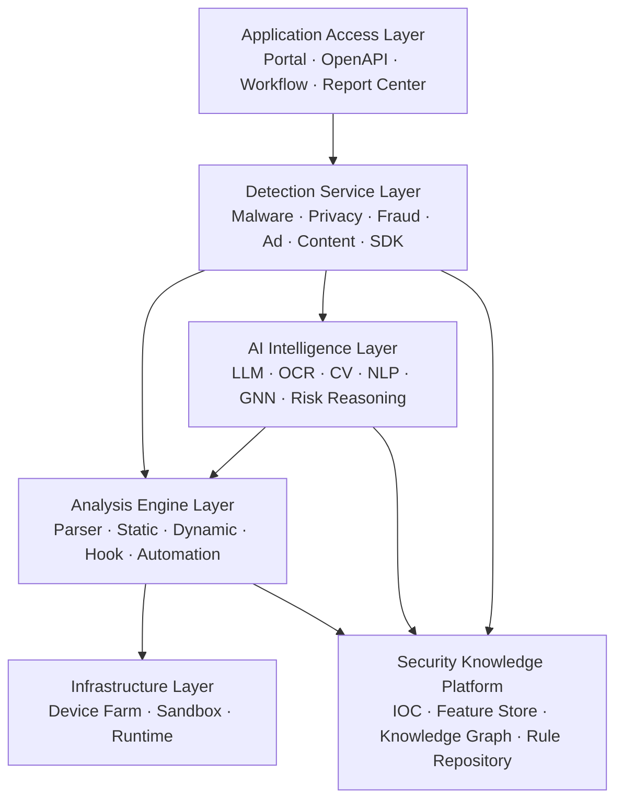
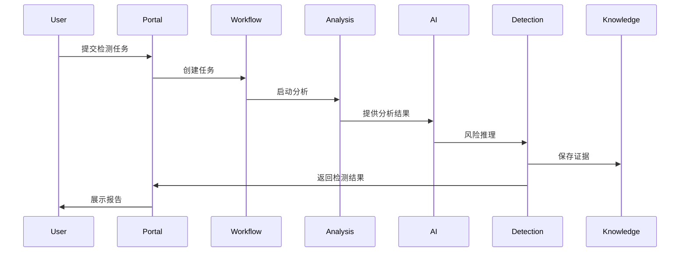

# 第3章 平台总体架构（Overall Architecture）

> **Chapter 3**
>
> **Overall Architecture**

---

# 1. 本章目标

本章给出 Mobile Application Security Analysis Platform（MASAP）的总体架构设计，是整个平台的核心架构章节。

本章定义：

- 平台总体设计原则
- 六层架构模型
- 各层职责边界
- 数据流与控制流
- 核心组件关系
- 统一分析流程
- 平台扩展方式

后续所有章节均围绕本章展开。

---

# 2. 总体设计理念

MASAP 并不是多个检测系统的简单组合，而是一个**统一的移动应用安全分析平台**。

平台采用 **Layered Architecture（分层架构）** 与 **Pipeline Architecture（分析流水线）** 相结合的设计模式：

- **分层架构（Layered Architecture）**：明确各层职责边界，实现模块解耦和独立演进。
- **分析流水线（Pipeline Architecture）**：将应用从接入、分析、检测、推理到输出形成标准化处理链路。
- **知识驱动（Knowledge-Driven）**：所有检测结果沉淀到统一知识平台，支持持续学习。
- **AI 原生（AI-Native）**：AI 不作为外挂能力，而是贯穿程序理解、行为分析、风险推理和报告生成全过程。

平台遵循 **Analyze Once, Use Everywhere** 的原则，即应用只进行一次基础分析，分析结果可被所有检测服务共享，避免重复解析和重复计算。

---

# 3. 平台总体架构

## 3.1 六层架构

平台由六个核心层组成：

| Layer | 核心职责 | 输出能力 |
|--------|----------|----------|
| Application Access Layer | 统一接入、任务编排、报告展示 | Portal、OpenAPI、Workflow |
| Detection Service Layer | 面向业务场景的检测服务 | 恶意软件、隐私、广告、涉诈、内容、SDK 等 |
| AI Intelligence Layer | AI 理解与风险推理 | OCR、CV、LLM、Graph Intelligence |
| Analysis Engine Layer | 程序分析与运行分析 | Static Analysis、Dynamic Analysis、Hook、Automation |
| Infrastructure Layer | 提供检测运行环境 | 真机、沙箱、环境模拟、设备云 |
| Security Knowledge Platform | 提供统一知识支撑 | IOC、画像、知识图谱、规则库、证据库 |

---

# 4. 各层职责说明

## 4.1 Infrastructure Layer（基础设施层）

基础设施层提供所有检测能力运行所需的执行环境。

核心能力包括：

- 真机集群（Device Farm）
- 沙箱集群（Sandbox Cluster）
- 环境仿真（Environment Simulation）
- 自动化运行环境
- 网络环境模拟
- 快照恢复
- 环境隔离
- 资源调度

**职责边界：**

负责"运行环境"，不负责"检测逻辑"。

---

## 4.2 Analysis Engine Layer（分析引擎层）

分析引擎层是平台的核心技术引擎。

负责将应用解析为统一的程序语义模型（Program Semantic Model）。

核心能力包括：

- 安装包解析（APK/HAP Parser）
- Manifest 解析
- DEX / ELF / SO 分析
- 字节码分析
- 控制流分析（CFG）
- 数据流分析（Data Flow）
- 调用图分析（Call Graph）
- 静态分析
- 动态分析
- Runtime Hook
- 自动化执行（Automation Engine）

输出统一的 Security Facts，为上层检测服务提供标准化数据。

---

## 4.3 AI Intelligence Layer（AI 智能层）

AI 层负责对分析引擎产生的数据进行智能理解与风险推理。

包括：

- OCR 页面识别
- 图像内容理解（CV）
- NLP 文本分析
- LLM 风险推理
- 恶意软件家族分类
- 相似应用识别
- 风险解释生成
- AI 辅助规则学习

AI 层既消费 Analysis Engine 输出的数据，也持续向 Security Knowledge Platform 写入新的知识。

---

## 4.4 Detection Service Layer（检测服务层）

检测服务层将基础分析能力封装为具体业务能力。

包括：

- 恶意软件检测（Malware Detection）
- 隐私违规检测（Privacy Compliance）
- 恶意广告检测（Ad Detection）
- 涉诈检测（Fraud Detection）
- 内容安全检测（Content Security）
- 仿冒侵权检测（Impersonation Detection）
- SDK 风险检测（SDK Risk Detection）

每项检测能力均通过统一接口调用 Analysis Engine 与 AI Intelligence，不直接依赖基础设施。

---

## 4.5 Application Access Layer（应用接入层）

应用接入层是平台对外的统一入口。

主要包括：

- Portal
- Workflow
- OpenAPI
- Report Center
- RBAC
- 审计日志
- 通知中心

所有外部系统均通过本层访问平台能力。

---

## 4.6 Security Knowledge Platform（安全知识平台）

安全知识平台是整个平台的长期记忆。

负责统一管理：

- IOC
- 恶意样本
- 开发者画像
- SDK 知识库
- 域名/IP 信誉
- 数字证书信誉
- 知识图谱
- Feature Store
- Embedding Store
- 检测证据
- AI 数据集

平台所有分析结果最终都会沉淀到知识平台，实现持续学习与能力演进。

---

# 5. 平台数据流

移动应用从接入到输出检测结果的处理流程如下：

处理过程包括：

1. 上传应用安装包；
2. Workflow 创建检测任务；
3. 调度执行环境（真机/沙箱）；
4. Analysis Engine 完成程序分析；
5. AI 层完成智能理解与风险推理；
6. Detection Service 输出各类检测结果；
7. 检测结果与证据写入 Security Knowledge Platform；
8. 生成统一风险报告。

---

# 6. 平台控制流

平台控制流程如下：

控制流强调：

- Workflow 是统一任务调度中心；
- Analysis Engine 是统一分析入口；
- Detection Service 不直接控制基础设施；
- Security Knowledge Platform 负责统一沉淀分析结果。

---

# 7. 平台核心设计原则

MASAP 的总体架构遵循以下原则：

1. **Layered Architecture**：严格按照六层职责划分，避免跨层耦合。
2. **Analyze Once, Use Everywhere**：分析结果一次生成，多业务共享。
3. **Knowledge Driven**：所有检测结果沉淀为知识资产。
4. **AI Native**：AI 深度参与分析、推理和报告生成，而非外挂能力。
5. **Detection as a Service**：所有检测能力服务化，通过统一 API 输出。
6. **Cloud Native**：支持容器化、微服务和 Kubernetes 部署。
7. **Plugin Architecture**：检测能力插件化，便于持续扩展。

---

# 8. 本章总结

本章定义了 MASAP 的总体架构模型，明确了六层架构的职责边界、数据流、控制流及核心设计原则。

后续章节将以本章为基础，分别深入介绍各层的内部架构、关键技术、数据模型及工程实现方式，形成完整、统一、可扩展的移动应用安全检测平台技术体系。

---

## 下一章

**第4章 系统上下文（System Context）**

下一章将从平台与外部生态的关系出发，介绍 MASAP 与应用商店、开发者平台、CI/CD、威胁情报平台、安全运营中心等外部系统的交互关系，并建立整体上下文视图（Context Diagram）。
