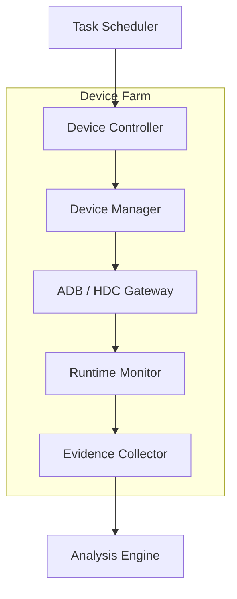
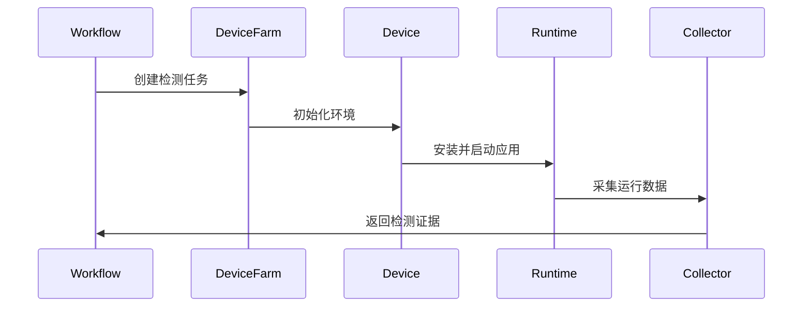

# 第5章 真机检测平台（Device Farm）

> **Chapter 5**
>
> **Device Farm**

---

# 1. 本章目标（Objectives）

真机检测平台（Device Farm）负责为移动应用安全检测提供真实终端运行环境，是平台动态分析能力的重要组成部分。

相比虚拟机或沙箱环境，真机能够真实提供 CPU、TEE、Keystore、生物认证、安全芯片、厂商 ROM 等硬件能力，是验证运行时行为、发现环境对抗及分析高级恶意软件的重要基础。

本章重点介绍：

- 真机平台建设目标；
- 总体架构设计；
- 核心组件及职责；
- 检测任务执行流程；
- 数据采集体系；
- 调度管理；
- 技术指标。

---

# 2. 为什么需要真机平台（Motivation）

虽然沙箱能够满足绝大多数应用的自动化检测需求，但在以下场景中仍然无法替代真实终端：

- 应用通过模拟器检测主动退出；
- 利用 Android Keystore、TEE 等硬件能力完成密钥保护；
- 检测设备品牌、ROM、BootLoader、SELinux 等系统属性；
- 调用指纹、人脸、安全支付等硬件接口；
- 运行依赖 GPU、Camera、Sensor 等真实硬件；
- 厂商 ROM（如 MIUI、One UI、HarmonyOS）存在定制行为；
- 恶意软件针对特定硬件环境触发攻击逻辑。

因此，平台需要构建可统一管理的大规模真机检测平台，与沙箱形成互补。

---

# 3. 总体架构

真机平台由六个核心组件组成：

| 组件 | 职责 |
|------|------|
| Task Scheduler | 接收并分发检测任务 |
| Device Controller | 控制设备生命周期 |
| Device Manager | 管理设备状态及资源 |
| ADB/HDC Gateway | 提供 Android/HarmonyOS 控制通道 |
| Runtime Monitor | 运行时行为监控 |
| Evidence Collector | 检测数据采集 |

---

# 4. 核心组件设计

## 4.1 Device Manager

Device Manager 是真机平台的资源管理中心。

主要职责包括：

- 设备注册；
- 在线状态检测；
- 电量管理；
- 温度监控；
- USB 状态管理；
- 网络状态检测；
- 系统版本管理；
- 标签管理（品牌、型号、ROM）。

每台设备维护统一元数据，例如：

| 属性 | 示例 |
|------|------|
| Device ID | Pixel-001 |
| Brand | Google |
| Model | Pixel 9 Pro |
| OS | Android 16 |
| ABI | arm64-v8a |
| Screen | 1344×2992 |
| Status | Idle / Busy / Offline |

---

## 4.2 Device Controller

负责检测任务执行过程中的设备控制。

包括：

- 安装应用；
- 卸载应用；
- 启动 Activity；
- 停止应用；
- 权限授权；
- 文件上传下载；
- 屏幕点击；
- 手势输入；
- 文本输入；
- 截图；
- 录屏。

Android 推荐基于 ADB 实现，HarmonyOS 基于 HDC 实现统一封装。

---

## 4.3 Runtime Monitor

Runtime Monitor 负责采集应用运行时行为。

主要包括：

### 系统行为

- Activity 生命周期；
- Service 生命周期；
- Broadcast；
- JobScheduler；
- AlarmManager。

### API 调用

- 权限申请；
- Camera；
- Location；
- SMS；
- Contacts；
- Clipboard；
- MediaProjection；
- Accessibility。

### 网络行为

- DNS；
- Socket；
- HTTP；
- HTTPS；
- WebSocket；
- QUIC。

### 文件行为

- 创建；
- 删除；
- 修改；
- SQLite；
- SharedPreferences；
- 外部存储访问。

### Native 行为

- dlopen；
- JNI；
- mmap；
- ptrace；
- fork；
- execve。

---

## 4.4 Evidence Collector

负责统一采集检测证据。

输出内容包括：

- Logcat；
- Kernel Log；
- Network PCAP；
- Runtime Hook；
- Screenshot；
- Screen Recording；
- File Snapshot；
- Memory Dump；
- Crash Dump。

所有证据统一输出至 Analysis Engine。

---

# 5. 检测流程

检测流程包括：

1. Workflow 创建检测任务；
2. Device Farm 选择符合条件的设备；
3. 初始化设备环境；
4. 安装应用；
5. 自动执行检测脚本；
6. Runtime Monitor 持续采集行为；
7. Collector 输出检测证据；
8. 环境恢复并释放设备。

---

# 6. 设备调度策略

平台采用标签驱动（Label-Based Scheduling）的调度方式。

设备标签包括：

- 品牌；
- 型号；
- Android API；
- HarmonyOS Version；
- CPU ABI；
- 是否 Root；
- 是否支持 TEE；
- 是否支持 NFC；
- 是否支持 Camera。

调度策略：

1. 满足检测要求；
2. 优先空闲设备；
3. 负载均衡；
4. 同型号轮询；
5. 故障自动切换。

---

# 7. 数据输出模型

真机平台统一输出以下数据：

| 数据类型 | 描述 |
|----------|------|
| Device Metadata | 设备信息 |
| Runtime Log | 应用日志 |
| Hook Event | Hook 数据 |
| Network Traffic | 网络流量 |
| Screenshot | 页面截图 |
| Video | 录屏 |
| File Snapshot | 文件快照 |
| Memory Snapshot | 内存快照 |
| Crash Log | 崩溃信息 |

这些数据统一交由 Analysis Engine 建模。

---

# 8. 关键技术

真机平台重点解决以下技术问题：

## 8.1 多设备统一管理

支持 Android 与 HarmonyOS 的统一设备管理接口，屏蔽底层控制差异。

## 8.2 环境快速恢复

通过快照、自动清理及批量初始化，保证每次检测均从干净环境开始。

## 8.3 高并发调度

支持多设备并发执行检测任务，并具备自动负载均衡能力。

## 8.4 反检测能力

降低被应用识别为自动化检测环境的概率，包括：

- 随机化操作轨迹；
- 模拟真实用户交互；
- 保持设备长期在线状态；
- 保留真实用户数据特征。

> **说明：**反检测能力的目标是提高检测覆盖率，而非绕过安全机制或实施攻击行为。

---

# 9. 技术指标（Metrics）

| 指标 | 建议值 |
|------|--------:|
| 真机品牌覆盖 | ≥15 个 |
| 真机型号覆盖 | ≥100 款 |
| Android 版本覆盖 | Android 8–16 |
| HarmonyOS 版本覆盖 | 5.x–6.x |
| 单设备环境恢复时间 | ≤120 秒 |
| 应用安装成功率 | ≥99% |
| 应用启动成功率 | ≥98% |
| Runtime 数据采集覆盖率 | ≥95% |
| 网络流量采集覆盖率 | 100% |
| 日志完整性 | 100% |
| 平均任务调度时间 | ≤5 秒 |

---

# 10. 本章总结（Summary）

真机检测平台为移动应用安全检测提供真实、可信的运行环境，是动态分析和高级恶意行为识别的重要基础设施。

通过统一的设备管理、运行时监控、证据采集及调度机制，平台能够支撑复杂场景下的安全检测，并与沙箱平台形成互补，共同构建完整的动态分析能力。

---

## 下一章

**第6章 沙箱集群（Sandbox Cluster）**

下一章将介绍沙箱集群的总体架构、环境仿真、反环境识别、批量执行、快照恢复及与真机平台的协同机制。
