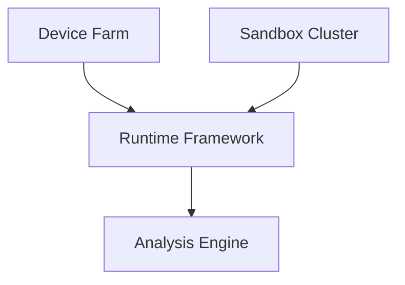
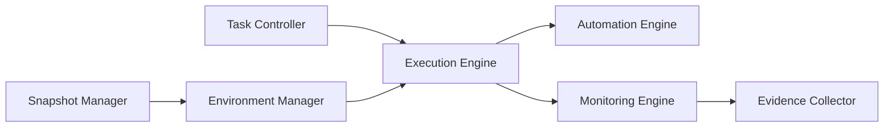
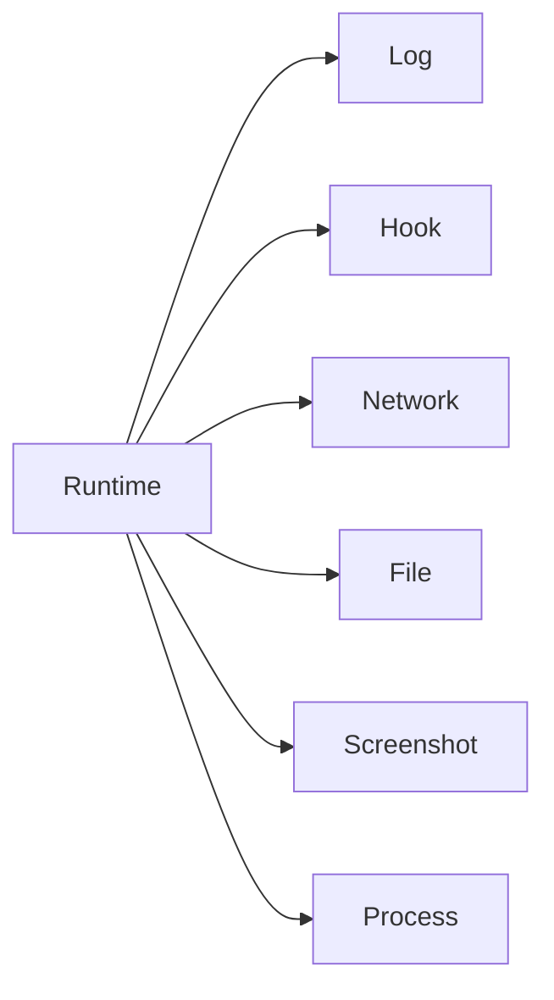

# 第7章 运行时框架（Runtime Framework）

> **Chapter 7**
>
> **Runtime Framework**

---

# 1. 本章目标（Objectives）

运行时框架（Runtime Framework）是移动应用安全检测平台基础设施层的核心软件组件。

它负责连接：

- 真机检测平台（Device Farm）
- 沙箱集群（Sandbox Cluster）
- 分析引擎（Analysis Engine）

为应用安全检测提供统一的运行控制、行为采集、自动化执行和证据输出能力。

本章重点介绍：

- Runtime Framework 的定位；
- 总体架构；
- 核心模块；
- 数据采集体系；
- 自动化执行机制；
- 生命周期管理；
- 技术指标。

---

# 2. 为什么需要 Runtime Framework（Motivation）

移动应用安全检测不同于普通 App 自动化测试。

普通测试关注：

- 页面是否正常；
- 功能是否可用；
- 性能是否达标。

安全检测关注：

- 应用调用了什么系统能力；
- 是否访问敏感数据；
- 是否存在隐藏行为；
- 是否动态加载代码；
- 是否与恶意服务器通信；
- 是否触发欺诈流程。

因此平台需要一个统一运行时框架，对应用运行全过程进行：

- 控制；
- 观测；
- 记录；
- 分析。

---

# 3. 在整体架构中的定位

Runtime Framework 位于 Infrastructure Layer 内部。



Runtime Framework 不判断风险。

它只负责：

> 获取应用运行事实（Runtime Facts）。

---

# 4. 总体架构



核心模块：

| 模块 | 职责 |
|-|-|
| Task Controller | 任务控制 |
| Execution Engine | 应用执行 |
| Automation Engine | 自动化交互 |
| Monitoring Engine | 行为监控 |
| Evidence Collector | 证据采集 |
| Environment Manager | 环境管理 |
| Snapshot Manager | 快照恢复 |

---

# 5. Task Controller

Task Controller 是运行任务入口。

负责：

- 创建任务；
- 分配执行环境；
- 管理任务状态；
- 控制执行流程；
- 处理异常。

任务状态：

```text
CREATED

↓

INITIALIZING

↓

RUNNING

↓

COLLECTING

↓

FINISHED

↓

RESET
```

---

# 6. Execution Engine

Execution Engine 负责应用生命周期控制。

主要能力：

## 应用安装

支持：

- APK
- AAB
- HAP

能力：

- 签名校验；
- 安装参数控制；
- 权限初始化。

---

## 应用启动

支持：

- Launcher 启动；
- Activity 启动；
- Deep Link；
- Intent 调用。

---

## 应用控制

包括：

- 前后台切换；
- 强制停止；
- 清理数据；
- 重启应用。

---

# 7. Automation Engine

自动化执行引擎负责模拟用户行为。

包括：

## UI 自动化

支持：

- 点击；
- 滑动；
- 输入；
- 页面遍历。

---

## 行为探索

包括：

- Monkey；
- 模型驱动探索；
- 页面状态遍历；
- 风险页面优先探索。

---

## 场景驱动

支持：

不同应用类型使用不同测试策略：

| 类型 | 重点场景 |
|-|-|
| 金融 | 登录、支付 |
| 社交 | 聊天、分享 |
| 游戏 | 广告、充值 |
| 工具 | 权限申请 |

---

# 8. Monitoring Engine

Monitoring Engine 是 Runtime Framework 的核心能力。

负责捕获应用运行事实。

---

## 8.1 API 行为监控

监控：

- Camera
- Location
- Microphone
- Contacts
- SMS
- Clipboard
- Accessibility

---

## 8.2 文件行为监控

包括：

- 创建文件；
- 修改文件；
- 删除文件；
- 数据库访问。

---

## 8.3 网络行为监控

包括：

- DNS 请求；
- IP 地址；
- URL；
- TLS 信息；
- 数据流量。

---

## 8.4 进程行为监控

包括：

- Process Create
- Thread Create
- Native Load
- Dynamic Library Load

---

# 9. Evidence Collector

Evidence Collector 将运行行为转换为标准安全证据。

输出：

```json
{
"type":"network_event",
"time":"2026-07-01",
"process":"app",
"domain":"example.com",
"action":"connect"
}
```

统一证据类型：

| 类型 | 内容 |
|-|-|
| Runtime Event | 行为事件 |
| API Event | API调用 |
| Network Event | 网络访问 |
| File Event | 文件操作 |
| Screen Event | 页面行为 |
| Process Event | 进程行为 |

---

# 10. Snapshot Manager

负责检测环境恢复。

能力：

- 初始快照；
- 增量快照；
- 快速恢复；
- 异常回滚。

目标：

保证：

> 每一次检测都从可信环境开始。

---

# 11. Runtime Framework 输出

Runtime Framework 输出统一数据：



这些数据进入：

Analysis Engine Layer。

---

# 12. 关键技术

## 12.1 跨系统统一抽象

屏蔽：

- Android ADB
- Harmony HDC

差异。

提供统一接口：

```
InstallApp()

LaunchApp()

CollectLog()

CaptureNetwork()

ResetEnvironment()
```

---

## 12.2 高性能事件采集

支持：

- 异步采集；
- 流式传输；
- 事件过滤；
- 批量上传。

---

## 12.3 可扩展监控插件

支持新增：

- API Hook；
- 网络解析；
- 行为规则。

---

# 13. 技术指标（Metrics）

| 指标 | 目标 |
|-|-:|
| 应用启动成功率 | ≥98% |
| 行为采集成功率 | ≥95% |
| 事件丢失率 | ≤1% |
| 自动化执行成功率 | ≥95% |
| 环境恢复成功率 | ≥99% |
| 单任务控制延迟 | ≤100ms |
| 支持并发任务 | ≥1000 |

---

# 14. 本章总结（Summary）

Runtime Framework 是移动应用安全检测平台的运行控制核心。

它连接设备环境与分析引擎，将应用运行过程转换为标准化安全事实，为后续静态分析、动态分析、AI 推理和风险检测提供基础数据。

通过统一执行、监控、采集和恢复能力，Runtime Framework 使平台具备规模化、自动化、可观测的动态检测能力。

---

## 下一章

**第8章 环境仿真（Environment Simulation）**

下一章将详细介绍运行环境真实性建设，包括设备画像、用户画像、网络画像、传感器模拟、地理环境模拟以及环境指纹管理。
