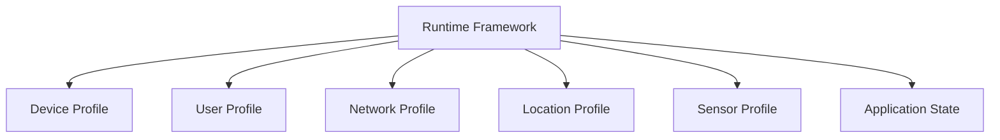
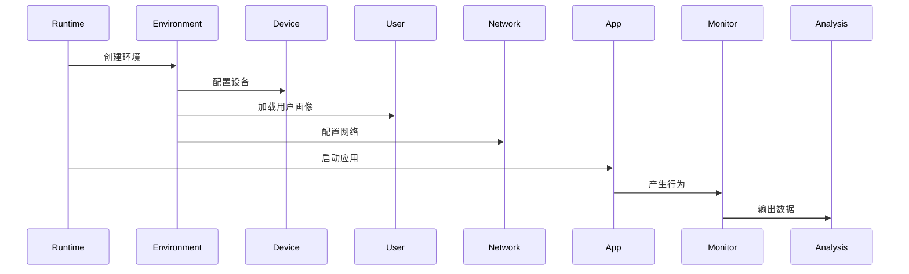

# 第8章 环境仿真（Environment Simulation）

> **Chapter 8**
>
> **Environment Simulation**

---

# 1. 本章目标（Objectives）

环境仿真（Environment Simulation）是移动应用安全检测平台提高动态检测真实性的重要能力。

其目标不是简单模拟设备信息，而是在检测环境中构造接近真实用户终端的运行条件，使应用能够按照真实用户场景运行，从而提升恶意行为、隐私违规行为及风险业务逻辑的触发概率。

本章介绍：

- 环境仿真的设计目标；
- 环境模型体系；
- 核心仿真能力；
- 环境指纹管理；
- 场景化环境构造；
- 技术指标。

---

# 2. 为什么需要环境仿真（Motivation）

移动应用越来越依赖运行环境决定自身行为。

同一个应用可能因为：

- 设备型号不同；
- 系统版本不同；
- 用户数据不同；
- 地理位置不同；
- 网络状态不同；
- 时间不同；

而表现出完全不同的逻辑。

例如：

- 恶意广告 SDK 根据地区投放不同广告；
- 涉诈应用仅针对特定地区用户展示诈骗页面；
- 木马会检测设备属性后决定是否释放恶意模块；
- 应用发现模拟器环境后隐藏关键行为；
- 隐私违规行为只有首次运行或特定权限状态触发。

因此：

> 动态检测的效果高度依赖运行环境真实性。

---

# 3. 环境仿真总体架构

环境仿真作为 Runtime Framework 的能力组件，为真机和沙箱共同提供环境管理能力。



环境仿真由六类核心模型组成：

| 模型 | 作用 |
|-|-|
| Device Profile | 设备属性模拟 |
| User Profile | 用户行为环境 |
| Network Profile | 网络环境 |
| Location Profile | 地理环境 |
| Sensor Profile | 传感器环境 |
| Application State | 应用状态 |

---

# 4. Device Profile（设备画像）

设备画像用于构造真实终端属性。

包括：

## 硬件属性

- CPU 架构；
- CPU 核数；
- GPU；
- 内存；
- 存储空间；
- 屏幕尺寸；
- 分辨率。

---

## 系统属性

包括：

- Android Version；
- API Level；
- HarmonyOS Version；
- Kernel Version；
- Build Fingerprint；
- ROM 信息。

---

## 设备身份属性

包括：

- Device ID；
- Android ID；
- OAID；
- IMEI（合法模拟环境）；
- SIM 信息。

---

## 硬件能力

包括：

- Camera；
- Bluetooth；
- NFC；
- GPS；
- Sensor；
- Biometric Capability。

---

# 5. User Profile（用户画像）

真实用户环境是动态检测的重要因素。

用户画像包括：

## 基础数据

- 联系人；
- 短信；
- 通话记录；
- 日历；
- 图片；
- 文件。

---

## 应用生态

模拟：

- 已安装应用；
- 常用应用；
- 用户使用历史。

例如：

金融应用：

```
银行App
支付App
通讯App
```

游戏用户：

```
游戏平台
社交App
视频App
```

---

## 用户行为模型

包括：

- 点击习惯；
- 页面访问路径；
- 输入行为；
- 使用时间。

---

# 6. Network Profile（网络环境）

网络环境是恶意行为触发的重要因素。

模拟：

## 网络类型

- WiFi；
- 4G；
- 5G；
- VPN。

---

## 网络质量

包括：

- 延迟；
- 丢包；
- 带宽；
- DNS。

---

## 网络位置

包括：

- 国家；
- 城市；
- ISP；
- ASN。

---

# 7. Location Profile（地理环境）

模拟：

- GPS；
- 基站；
- 国家地区；
- 时区；
- Locale。

应用可能根据：

- 国家；
- 城市；
- 时区；

决定不同业务逻辑。

---

# 8. Sensor Profile（传感器环境）

模拟：

- 加速度计；
- 陀螺仪；
- 光线传感器；
- 磁力计；
- NFC；
- 蓝牙。

用于支持：

- 金融认证；
- 游戏行为；
- 运动类应用；
- 风险识别。

---

# 9. Application State（应用状态）

应用行为不仅取决于设备，也取决于自身状态。

需要管理：

- 首次启动；
- 已登录；
- 未登录；
- 已授权；
- 未授权；
- 使用次数；
- 缓存状态。

例如：

恶意广告：

```
第一次启动：
正常页面

第三次启动：
弹出诱导广告
```

---

# 10. 环境模板（Environment Template）

平台采用模板化环境管理。

示例：

## 普通用户环境

```
Device:
Android 15

Network:
5G

Apps:
微信
支付宝

Location:
北京
```

---

## 金融用户环境

```
Device:
高端设备

Apps:
银行App

Security:
TEE Enabled

Network:
可信网络
```

---

## 海外用户环境

```
Location:
US

Language:
English

Network:
US ISP
```

---

# 11. 环境真实性评估

平台建立 Environment Fidelity Score。

公式：

```
Environment Fidelity Score

=

Device Similarity

+

User Similarity

+

Network Similarity

+

Behavior Similarity
```

用于评价检测环境真实性。

---

# 12. 环境指纹管理

应用可能通过环境特征判断：

是否运行于：

- 模拟器；
- 自动化环境；
- 检测环境。

因此平台需要维护：

## Environment Fingerprint

包括：

- 系统属性；
- API 返回值；
- 文件结构；
- 传感器行为；
- 网络特征。

用于分析：

- 应用环境识别行为；
- 反分析行为。

---

# 13. 与动态检测协同流程



---

# 14. 关键技术

## 14.1 环境模板管理

支持：

- 创建；
- 复制；
- 版本控制；
- 自动选择。

---

## 14.2 环境一致性

保证：

设备信息、

系统接口、

用户数据、

网络状态

之间逻辑一致。

---

## 14.3 场景驱动生成

根据应用类型自动生成环境：

例如：

金融：

```
真实用户
高安全设备
支付环境
```

广告检测：

```
普通用户
丰富App生态
真实网络
```

---

# 15. 技术指标（Metrics）

| 指标 | 目标 |
|-|-:|
| 设备属性覆盖率 | ≥98% |
| 系统接口模拟覆盖率 | ≥95% |
| 用户画像模板数量 | ≥100 |
| 网络环境模板数量 | ≥50 |
| 环境初始化时间 | ≤30秒 |
| 环境一致性评分 | ≥95% |
| 模板切换时间 | ≤10秒 |

---

# 16. 本章总结（Summary）

环境仿真是移动应用安全检测平台提升检测真实性的重要能力。

通过设备画像、用户画像、网络画像、地理环境及应用状态管理，平台能够构建接近真实用户的运行环境，提高恶意行为触发概率，降低因检测环境差异导致的漏检风险。

至此，Infrastructure Layer 完成闭环：

```text
Infrastructure Layer

├── Device Farm
│
├── Sandbox Cluster
│
├── Runtime Framework
│
└── Environment Simulation
```

下一阶段将进入：

# Analysis Engine Layer

该层是整个移动应用安全检测平台的核心技术层。

---

## 下一章

**第9章 分析引擎总体架构（Analysis Engine Overview）**

下一章将介绍：

- 为什么需要统一分析引擎；
- Static Analysis 与 Dynamic Analysis 的关系；
- Program Representation；
- Security Facts 数据模型；
- 分析流水线；
- 与 Detection Service 的接口关系。
