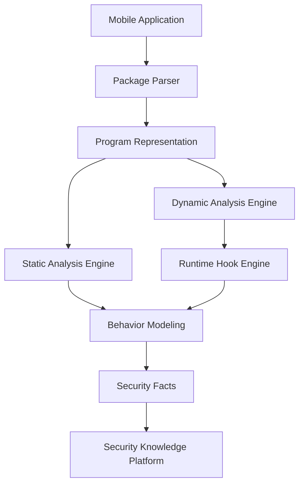
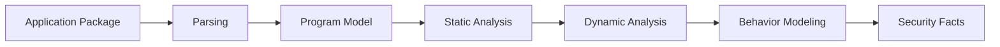

# 第9章 分析引擎总体架构（Analysis Engine Overview）

> **Chapter 9**
>
> **Analysis Engine Overview**

---

# 1. 本章目标（Objectives）

分析引擎层（Analysis Engine Layer）是移动应用安全检测平台的核心技术层。

其核心目标是：

> 将移动应用从一个不可理解的软件包，转换为结构化、可计算、可关联的安全事实（Security Facts）。

分析引擎负责连接：

- 应用二进制文件；
- 程序结构；
- 代码行为；
- 运行时行为；
- AI 分析模型；
- 安全检测服务。

本章介绍：

- 分析引擎建设目标；
- 总体架构；
- 分析流水线；
- 核心组件；
- 数据模型；
- 与上下层关系。

---

# 2. 为什么需要统一分析引擎（Motivation）

移动应用安全检测面对的对象并不是简单文件，而是复杂的软件系统。

一个移动应用通常包含：

- Java/Kotlin 代码；
- Native C/C++代码；
- 第三方 SDK；
- 动态加载模块；
- 加密代码；
- 网络通信逻辑；
- 用户交互逻辑；
- 服务端动态配置。

传统检测方式：

```
规则扫描
+
黑名单匹配
```

无法覆盖复杂风险。

例如：

## 场景1：恶意 SDK

静态扫描发现：

```
SDK_xxx.so
```

但无法判断：

运行时是否：

- 收集设备信息；
- 上传用户数据；
- 下载远程代码。

---

## 场景2：动态广告

代码中没有明显广告逻辑。

但运行后：

```
启动App

↓

访问服务器

↓

返回广告策略

↓

弹窗
```

必须结合：

静态分析 + 动态分析。

---

## 场景3：涉诈应用

代码可能完全正常。

但是：

运行流程：

```
打开App

↓

诱导登录

↓

伪造页面

↓

诱导转账
```

必须理解：

代码、

界面、

网络、

行为。

---

因此平台需要统一分析引擎。

---

# 3. 分析引擎总体架构



---

# 4. 分析流水线（Analysis Pipeline）

整个分析流程：



---

# 5. 核心组件

分析引擎由以下模块组成：

| 模块 | 职责 |
|-|-|
| Package Parser | 应用包解析 |
| Program Representation | 程序统一表示 |
| Static Analysis Engine | 静态程序分析 |
| Dynamic Analysis Engine | 动态行为分析 |
| Runtime Hook Engine | 运行时采集 |
| Behavior Modeling | 行为建模 |
| Fact Generator | 安全事实生成 |

---

# 6. Package Parser（应用解析）

Package Parser 是分析入口。

支持：

## Android

包括：

- APK
- AAB
- DEX
- ELF
- SO
- Manifest

---

## HarmonyOS

包括：

- HAP
- ABC Bytecode
- Ark Runtime Metadata

---

解析内容：

## 应用元信息

- Package Name
- Version
- Signature
- Certificate
- Permission

---

## 代码结构

包括：

- Class
- Method
- Function
- Dependency

---

## 资源信息

包括：

- XML
- Image
- String
- Configuration

---

# 7. Program Representation（程序统一表示）

不同平台：

Android：

```
Java/Kotlin

↓

DEX

↓

ART Runtime
```

HarmonyOS：

```
ArkTS

↓

ABC Bytecode

↓

Ark Runtime
```

平台需要统一抽象。

因此设计：

## Mobile Application IR

（Intermediate Representation）

统一表示：

```text
Application

├── Component

├── Class

├── Method

├── Function

├── Call Graph

├── Data Flow

├── Resource

└── Permission
```

---

# 8. Static Analysis Engine

静态分析负责：

> 不运行应用，理解应用内部结构和潜在风险。


能力包括：

## Code Analysis

- 控制流分析（CFG）
- 调用图分析（CG）
- 数据流分析（DFG）


## Permission Analysis

分析：

- 权限申请；
- 权限使用；
- 权限传播。


## SDK Analysis

识别：

- 第三方 SDK；
- SDK 版本；
- SDK 行为。


## Malware Feature Extraction

提取：

- API调用；
- 字符串；
- 加密行为；
- 网络地址。

---

# 9. Dynamic Analysis Engine

动态分析负责：

> 观察应用真实运行行为。

输入来自：

Infrastructure Layer。

包括：

- Runtime Log
- Hook Event
- Network Traffic
- Screenshot


分析：

## Runtime Behavior

例如：

```
App

↓

读取联系人

↓

访问服务器

↓

上传数据
```


---

# 10. Behavior Modeling

将原始事件转换为行为模型。

例如：

原始事件：

```
getLocation()

connect(ip)

send(data)
```


转换：

```
Location Collection

+

Remote Communication

+

Data Upload
```

形成：

Behavior Graph。

---

# 11. Security Facts

分析引擎最终输出：

Security Facts。

这是整个系统的重要数据标准。

示例：

```json
{
"type":"privacy_behavior",

"source":"location",

"api":"LocationManager",

"destination":"xxx.com",

"risk":"high"
}
```

Security Facts 被：

- Detection Service
- AI Engine
- Knowledge Platform

共同消费。

---

# 12. 与其他层关系

## 与 Infrastructure Layer

输入：

```
Runtime Data
```

输出：

```
Behavior Facts
```


---

## 与 AI Intelligence Layer

AI 提供：

- 分类；
- 推理；
- 相似分析。


---

## 与 Detection Service Layer

检测服务消费：

```
Security Facts
```

进行：

- 恶意软件检测；
- 隐私检测；
- 涉诈检测。

---

# 13. 关键设计原则

## 13.1 Analyze Once, Use Everywhere

应用解析一次。

所有检测共享分析结果。


---

## 13.2 Static + Dynamic Fusion

静态：

回答：

> 应用具有什么能力？

动态：

回答：

> 应用实际做了什么？


---

## 13.3 Fact-Oriented Architecture

不直接输出检测结果。

输出：

```
事实

↓

检测规则

↓

风险判断
```

---

## 13.4 Platform Independent

支持：

- Android
- HarmonyOS

统一分析模型。

---

# 14. 技术指标（Metrics）

| 指标 | 目标 |
|-|-:|
| APK/HAP解析成功率 | ≥99% |
| Manifest解析覆盖率 | 100% |
| Native库识别率 | ≥95% |
| 第三方SDK识别率 | ≥95% |
| 静态分析覆盖率 | ≥90% |
| 动态行为采集覆盖率 | ≥95% |
| Security Facts生成成功率 | ≥99% |
| 单应用分析时间 | ≤15分钟 |

---

# 15. 本章总结（Summary）

分析引擎层是移动应用安全检测平台的核心技术中枢。

通过统一应用解析、程序表示、静态分析、动态分析、行为建模和安全事实生成能力，平台能够将复杂移动应用转换为结构化安全数据。

该层向上支撑 AI Intelligence Layer 和 Detection Service Layer，向下连接 Infrastructure Layer，是整个安全检测体系的核心分析能力。

---

## 下一章

**第10章 应用包解析引擎（Package Parser）**

下一章将深入介绍：

- APK/HAP 文件结构解析；
- DEX/ABC/ELF 分析；
- Manifest 解析；
- 签名解析；
- 资源解析；
- 程序中间模型构建。
