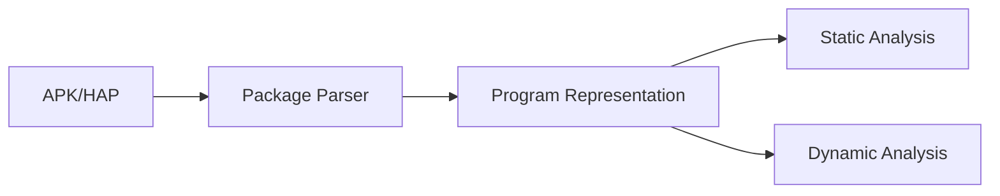
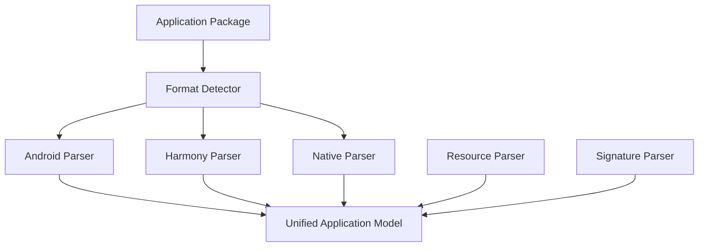

# 第10章 应用包解析引擎（Package Parser）

> **Chapter 10**
>
> **Package Parser**

---

# 1. 本章目标（Objectives）

应用包解析引擎（Package Parser）是移动应用安全分析流程的入口组件。

其核心目标是：

> 将不同移动操作系统、不同编译体系、不同打包格式的应用程序，解析为统一、安全可分析的数据模型。

支持：

- Android APK；
- Android App Bundle；
- HarmonyOS HAP；
- Native Library；
- 第三方 SDK；
- 资源文件；
- 配置文件。

本章介绍：

- 解析引擎总体架构；
- 文件格式解析；
- 元数据提取；
- 程序结构建模；
- 安全信息提取；
- 技术指标。

---

# 2. 为什么需要统一 Package Parser（Motivation）

移动应用生态存在多个技术体系：

Android：

```
Java/Kotlin

↓

DEX Bytecode

↓

ART Runtime
```

HarmonyOS：

```
ArkTS

↓

ABC Bytecode

↓

Ark Runtime
```

同时应用内部还可能包含：

```
Native C/C++

↓

ELF/SO

```

以及：

```
第三方SDK

动态库

资源文件

配置文件
```

如果每个检测能力自行解析：

会导致：

- 重复开发；
- 数据不一致；
- 检测结果无法关联；
- 分析成本增加。

因此平台需要统一 Package Parser。

---

# 3. Package Parser 在系统中的位置



Package Parser 输出：

不是风险结果。

而是：

> 应用结构事实（Application Facts）。

---

# 4. 总体架构



---

# 5. Format Detector（格式识别）

解析第一步：

识别应用类型。


支持：

| 类型 | 格式 |
|-|-|
| Android | APK |
| Android | AAB |
| HarmonyOS | HAP |
| Library | SO |
| Bytecode | DEX/ABC |


识别依据：

- 文件结构；
- Header；
- Manifest；
- Magic Number。

---

# 6. Android Package Parser

## 6.1 APK结构解析

APK 本质：

```
APK

├── AndroidManifest.xml

├── classes.dex

├── resources.arsc

├── lib/

│    ├── arm64-v8a

│    └── armeabi

├── assets/

└── META-INF/

```

---

## 6.2 Manifest解析

提取：

### 应用信息

- Package Name
- Version
- Min SDK
- Target SDK


### 四大组件

- Activity
- Service
- Broadcast Receiver
- Content Provider


### 权限

包括：

- 普通权限；
- 危险权限；
- 自定义权限。


---

## 6.3 DEX解析

DEX 是 Android 应用核心执行文件。


解析：

- Class；
- Method；
- Field；
- Annotation；
- String；
- Instruction。


输出：

```
Class Graph

Method Graph

Call Graph

```

---

# 7. HarmonyOS Package Parser

支持：

## HAP结构

```
HAP

├── module.json5

├── ets/

├── libs/

├── resources/

└── pack.info
```

---

## ABC Bytecode解析

提取：

- Module；
- Class；
- Method；
- Instruction；
- Dependency。


建立：

```
Ark Program Model

```

---

# 8. Native Parser

移动应用大量使用 Native 代码。

解析：

- ELF Header；
- Section；
- Symbol；
- Import；
- Export；
- String；
- JNI Interface。


识别：

- 加密代码；
- 动态加载；
- 反调试；
- 网络能力。

---

# 9. Signature Parser（签名分析）

应用签名是安全检测的重要输入。

解析：

Android：

- V1 Signature；
- V2 Signature；
- V3 Signature；
- V4 Signature。


HarmonyOS：

- Certificate Chain；
- Signature Block。


提取：

- 证书；
- 公钥；
- 签发机构；
- 有效期；
- 指纹。


用于：

- 开发者身份分析；
- 仿冒检测；
- 恶意应用关联。

---

# 10. Resource Parser

解析：

## 图片资源

用于：

- 仿冒检测；
- Logo分析。


## 字符串资源

用于：

- 域名发现；
- 诈骗关键词；
- 敏感信息。


## 配置文件

包括：

- XML；
- JSON；
- YAML。

---

# 11. 第三方 SDK 解析

Package Parser 需要识别：

应用依赖组件。


方法：

## 特征匹配

包括：

- Package Name；
- Class Pattern；
- Symbol Pattern。


## 代码相似分析

使用：

- Hash；
- AST；
- Embedding。


输出：

```
SDK Identity

SDK Version

SDK Risk Level

```

---

# 12. Unified Application Model

所有解析结果转换为统一模型。


```text
Application Model


Application

├── Metadata

├── Component

├── Permission

├── Code Entity

├── Dependency

├── Resource

├── Signature

├── Native Library

└── SDK

```

---

# 13. 输出数据模型

示例：

```json
{
"package":

"com.example.app",

"permissions":

[
"CAMERA",
"LOCATION"
],

"components":

120,

"native_lib":

5,

"sdk":

[
"SDK_A",
"SDK_B"
]
}
```

---

# 14. 异常处理能力

企业级解析必须支持异常应用。

包括：

- 加固应用；
- 壳应用；
- 混淆应用；
- 损坏包；
- 超大包。


处理策略：

## 多级解析

```
Full Parse

↓

Partial Parse

↓

Metadata Parse

```

保证：

即使无法完全解析，也能输出有效信息。

---

# 15. 关键技术

## 15.1 多格式统一抽象

Android：

DEX

Harmony：

ABC

Native：

ELF


统一：

Program Entity。


---

## 15.2 大规模解析能力

支持：

- 并行解析；
- 增量解析；
- 缓存。


---

## 15.3 安全解析

解析器自身必须隔离运行：

避免：

- 恶意文件攻击；
- 解析漏洞；
- 资源消耗攻击。


---

# 16. 技术指标（Metrics）

| 指标 | 目标 |
|-|-:|
| APK解析成功率 | ≥99% |
| HAP解析成功率 | ≥99% |
| Manifest解析覆盖率 | 100% |
| DEX解析覆盖率 | ≥98% |
| Native库识别率 | ≥95% |
| SDK识别率 | ≥95% |
| 单包解析时间 | ≤60秒 |
| 超大应用支持 | ≥5GB |

---

# 17. 本章总结（Summary）

Package Parser 是移动应用安全分析平台的数据入口。

通过统一解析 APK、HAP、DEX、ABC、ELF 以及应用资源，平台能够构建统一 Application Model，为后续程序分析、静态检测、动态检测和 AI 推理提供标准化输入。

解析质量直接决定整个安全检测体系的准确性，是 Analysis Engine Layer 的基础能力。

---

## 下一章

**第11章 程序统一表示与程序分析基础（Program Representation & Analysis）**

下一章将介绍：

- 为什么需要统一 IR；
- Android/HarmonyOS 程序抽象；
- CFG；
- Call Graph；
- Data Flow Graph；
- Program Semantic Model；
- Security Facts生成基础。
