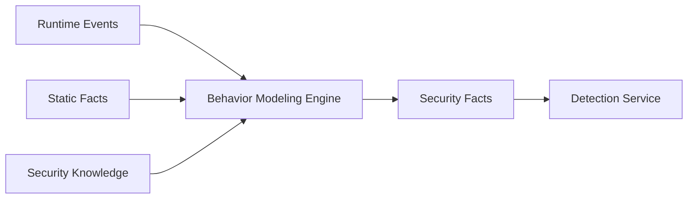
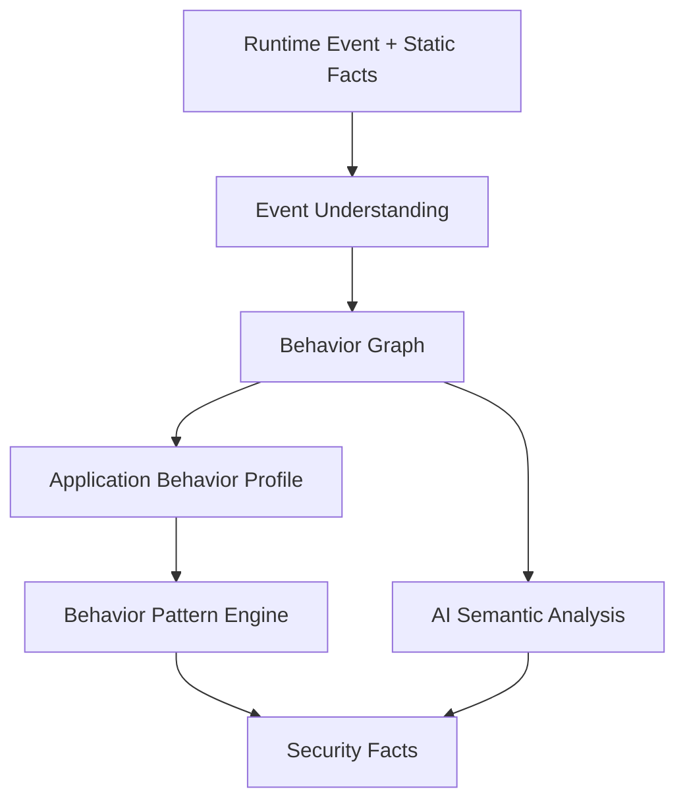

# 第15章 行为建模引擎（Behavior Modeling Engine）

> **Chapter 15**
>
> **Behavior Modeling Engine**

---

# 1. 本章目标（Objectives）

行为建模引擎（Behavior Modeling Engine）负责将应用运行过程中产生的大量低级技术事件，转换为能够被安全检测系统理解的高级行为模型。

核心目标：

> 从“应用调用了什么”推理“应用正在实施什么行为”。

---

传统安全分析：

```
API Event

↓

Rule Match

↓

Risk
```

存在问题：

- 规则数量巨大；
- 上下文不足；
- 误报高；
- 无法理解复杂行为链。


现代移动应用安全平台需要：

```
Event

↓

Behavior

↓

Intent

↓

Risk

```

---

# 2. 行为建模定位

Behavior Modeling 属于：

```
Analysis Engine Layer


Dynamic Analysis Engine

        ↓

Behavior Modeling Engine

        ↓

Security Facts

```

整体关系：



---

# 3. 行为建模总体架构



---

# 4. Event Understanding（事件理解）

原始事件：

例如：

```
API_CALL

getLocation()

NETWORK_REQUEST

upload data

SDK_CALL

xxxSDK

```

需要转换：

```
行为实体

Location Collection

Data Transmission

Third-party SDK Usage

```

---

# 5. Behavior Entity Model

平台定义统一行为实体。


结构：

```
Behavior Entity

{

Actor

Action

Object

Context

Evidence

}

```

---

例如：

原始：

```
Camera.open()

```

转换：

```
Actor:

Application


Action:

Collect


Object:

Camera Data

```

---

# 6. Behavior Graph（行为图）

行为建模核心数据结构。


表示：

```
实体

+

关系

```

---

## 6.1 节点类型


包括：

### Application

应用。


### Component

组件。


### SDK

第三方组件。


### Data

数据对象。


### API

系统能力。


### Network

外部服务。


---

## 6.2 边类型


包括：

调用：

```
App

↓

API

```


数据流：

```
Location

↓

Network

```


控制流：

```
Login

↓

Transfer

```

---

# 7. 行为链分析（Behavior Chain Analysis）

单个行为通常无风险。

风险来自组合。


例如：

普通：

```
Read Device ID

```

风险：

```
Read Device ID

↓

Encrypt

↓

Upload Unknown Server

```

形成：

```
Device Information Exfiltration

```

---

# 8. 应用行为画像（Application Behavior Profile）

每个应用建立长期画像。


包含：

## 权限画像

例如：

```
Camera

Location

Contacts

```

---

## 数据访问画像

例如：

```
Collect:

Device ID

Location

```

---

## 网络画像

例如：

```
Server:

xxx.com

Country:

xxx

```

---

## SDK画像

例如：

```
Advertising SDK

Analytics SDK

Payment SDK

```

---

# 9. 行为模式识别（Behavior Pattern Engine）

平台维护：

Behavior Pattern。


---

## 9.1 隐私泄露模式


模式：

```
Sensitive Data

+

Network Upload

```

例如：

```
Contacts

↓

Upload

```

---

## 9.2 恶意广告模式


模式：

```
Background Launch

+

Overlay Window

+

User Click Simulation

```

---

## 9.3 木马行为模式


模式：

```
Download Payload

+

Dynamic Load

+

Execute

```

---

## 9.4 涉诈行为模式


模式：

```
Fake Identity UI

+

Sensitive Input

+

Payment Guidance

```

---

# 10. 时间序列行为分析

很多风险具有时间特征。


例如：

安装后：

```
0s

启动


10s

申请权限


30s

上传数据

```

形成：

Behavior Sequence。


---

# 11. 行为聚类分析（Behavior Clustering）

用于发现未知风险。


输入：

```
Millions of Apps

```

提取：

Behavior Vector。


例如：

```
[

Location,

SMS,

Upload,

Dynamic Load

]

```

---

聚类发现：

未知恶意家族。

---

# 12. AI辅助行为理解

AI用于：

## 代码语义理解

理解：

```
function name

+

API

+

context

```

---

## 行为总结

例如：

输入：

```
50000 runtime events

```

输出：

```
Application collects device identifier
and sends it to third-party analytics server.
```

---

## 异常检测

发现：

与正常应用偏离的行为。


---

# 13. Security Fact生成

Behavior Modeling 输出：

统一安全事实。


示例：

```json
{

"type":

"data_exfiltration",


"data":

"location",


"destination":

"server_x",


"confidence":

0.95

}

```

---

# 14. 与Security Knowledge Platform关系

Behavior Modeling 不直接维护安全知识。

它消费：

Security Knowledge。


例如：

知识：

```
某SDK

↓

历史风险

↓

恶意行为模式

```

用于增强判断。

---

# 15. 技术指标（Metrics）

| 指标 | 目标 |
|-|-:|
| Event解析成功率 | ≥99% |
| 行为实体识别率 | ≥95% |
| 行为链构建覆盖率 | ≥90% |
| 行为模式匹配准确率 | ≥90% |
| 行为聚类稳定性 | ≥85% |
| 未知行为发现能力 | ≥80% |
| 单应用行为建模时间 | ≤5分钟 |

---

# 16. 本章总结（Summary）

Behavior Modeling Engine 是移动应用安全平台从“数据采集”走向“智能理解”的关键组件。

它通过：

```
Runtime Event

↓

Behavior Entity

↓

Behavior Graph

↓

Behavior Pattern

↓

Security Fact

```

将复杂应用运行过程转换为安全分析可理解的行为模型。

它是连接：

- Runtime Instrumentation；
- Detection Service；
- Security Knowledge Platform；

的核心桥梁。

---

## 下一章

**第16章 Security Fact Generation（安全事实生成引擎）**

下一章将定义：

- 为什么需要 Security Fact；
- Fact 数据模型；
- Static Fact；
- Runtime Fact；
- Knowledge Fact；
- Fact Fusion；
- 为检测服务提供标准输入。
