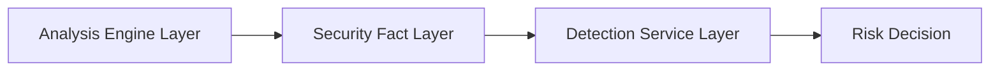
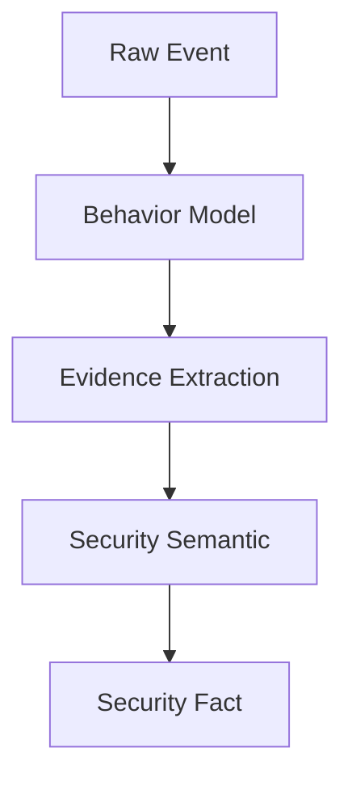

# 第16章 安全事实生成引擎（Security Fact Generation Engine）

> **Chapter 16**
>
> **Security Fact Generation Engine**

---

# 1. 本章目标（Objectives）

Security Fact Generation Engine 负责将来自不同分析能力的数据转换为标准化、安全语义化的数据对象。

核心目标：

> 将复杂的底层技术证据转换为检测服务可以直接使用的安全事实。

---

# 2. 为什么需要 Security Fact

移动应用检测平台包含大量分析能力：

包括：

- 静态分析；
- 动态分析；
- 网络分析；
- 行为分析；
- AI分析。


这些能力产生：

不同格式的数据。


例如：

静态分析：

```
Application contains Location API
```

动态分析：

```
Application accessed GPS at runtime
```

网络分析：

```
Application uploaded location data
```

如果检测服务直接使用这些数据：

会产生强耦合。


---

因此引入：

Security Fact Layer。


架构：

```
Analysis Engine

        |

Security Fact

        |

Detection Service

```

---

# 3. Security Fact定位

整体架构：



---

# 4. Security Fact定义

Security Fact 是：

> 经过分析、归纳和语义化处理后的安全证据对象。

它不是：

- 原始日志；
- API调用；
- 单个事件。


而是：

```
Evidence

+

Context

+

Meaning

+

Confidence

```

---

# 5. Security Fact数据模型

统一结构：

```json
{

"fact_id":

"SF001",


"fact_type":

"privacy_collection",


"subject":

"application",


"object":

"location_data",


"action":

"collect",


"context":

{},

"evidence":

[],


"confidence":

0.95

}

```

---

# 6. Fact分类体系

按照来源：

分为：

---

# 6.1 Static Fact

来源：

静态分析。


例如：

```
Application requests:

READ_CONTACTS

```

生成：

```
Sensitive Permission Usage

```

---

# 6.2 Runtime Fact

来源：

动态分析。


例如：

```
Runtime accessed Contacts

```

生成：

```
Actual Contact Collection

```

---

# 6.3 Network Fact

来源：

网络分析。


例如：

```
Data uploaded to unknown domain

```

生成：

```
External Data Transmission

```

---

# 6.4 Behavior Fact

来源：

行为建模。


例如：

```
Collect Device Info

+

Upload

```

生成：

```
Device Information Exfiltration

```

---

# 6.5 Knowledge Fact

来源：

安全知识平台。


例如：

```
SDK xxx

历史恶意广告组件

```

生成：

```
Risky SDK Identity

```

---

# 7. Fact生成流程



---

# 8. Evidence Management

每一个Fact必须具备：

可验证证据。


例如：

Privacy Fact：

包含：

```
API:

LocationManager


Timestamp:

xxx


Call Stack:

xxx


Network:

xxx

```

---

# 9. Fact Confidence模型

不同来源可信度不同。


示例：

|来源|可信度|
|-|-:|
|系统Trace|高|
|Runtime Hook|高|
|静态推断|中|
|AI预测|辅助|

---

综合：

```
Confidence

=

Evidence Weight

+

Behavior Match

+

Knowledge Score

```

---

# 10. Fact Fusion

多个Fact融合形成高级事实。


例如：

Fact1：

```
Access Location

```

Fact2：

```
Upload Location

```

Fact3：

```
Unknown Server

```

融合：

```
Location Data Leakage

```

---

# 11. Fact生命周期

```text
Create

↓

Validate

↓

Enrich

↓

Store

↓

Consume

↓

Feedback

```

---

# 12. Fact Storage设计

Security Fact需要支持：

## 查询

例如：

查询：

```
所有访问通讯录的应用

```

---

## 关联

例如：

```
App

SDK

Domain

Behavior

```

---

## 追踪

例如：

```
Risk Evolution

```

---

# 13. 与Detection Service关系

Detection Service 不直接读取：

```
API Event

```

而读取：

```
Security Fact

```

例如：

恶意广告检测：

输入：

```
Background Launch Fact

Overlay Fact

Auto Click Fact

```

输出：

```
Malicious Advertisement Risk

```

---

# 14. 与Security Knowledge Platform关系

Knowledge Platform 提供：

```
Knowledge Fact

```

例如：

```
SDK Reputation

Malware Family

Risk Domain

Attack Pattern

```

参与：

Fact Fusion。


---

# 15. 技术指标（Metrics）

|指标|目标|
|-|-:|
|Fact生成成功率|≥99%|
|Fact结构完整率|100%|
|Evidence关联率|≥95%|
|Fact查询响应|≤100ms|
|跨分析源融合准确率|≥90%|
|Fact版本兼容能力|支持多版本|

---

# 16. 本章总结（Summary）

Security Fact Generation Engine 是应用安全检测平台的重要中间抽象层。

它将：

```
Raw Event

↓

Behavior Model

↓

Security Fact

↓

Detection Service

```

形成标准化分析链路。

通过Security Fact：

- 底层采集能力可以持续演进；
- 检测服务无需关注底层实现；
- AI能力可以统一接入；
- 安全知识可以复用。


---

## 下一章

**第17章 AI Assisted Security Analysis（AI辅助安全分析引擎）**

下一章将介绍：

- 大模型在应用安全检测中的定位；
- AI代码理解；
- AI行为解释；
- AI风险研判；
- AI辅助规则生成；
- AI与传统检测融合架构。
